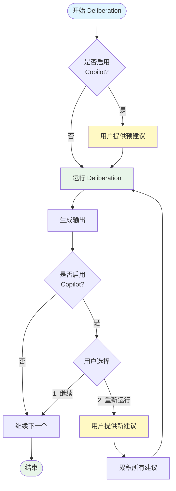

# Instructional Agents System - Workflow Diagram

本文档包含系统工作流程的可视化流程图。

## 完整系统流程图

## Foundation Phase详细流程图

## SlidesDeliberation详细流程图

## Agent交互模式图

## 数据流图

## Copilot Mode流程图

## 关键特点说明

### 1. 顺序上下文构建
每个Foundation Phase任务都使用之前所有任务的输出作为上下文，确保：
- 学习目标指导资源评估
- 资源评估影响目标受众分析
- 所有之前的输出指导大纲设计
- 大纲设计影响评估规划

### 2. 模板驱动生成
SlidesDeliberation使用分阶段模板生成：
- 先创建结构（outline, templates）
- 再填充内容（draft, LaTeX, script, assessment）
- 最后编译成最终文件

### 3. 上下文感知
- 每张幻灯片的生成都考虑相邻幻灯片
- Chapter开发考虑Foundation Phase的所有结果
- 脚本生成考虑前后幻灯片的过渡

### 4. 多Agent协作
- Foundation Phase: Teaching Faculty ↔ Instructional Designer/Course Coordinator
- SlidesDeliberation: Instructional Designer → Teaching Faculty → Teaching Assistant

---

这些流程图展示了系统从课程名称输入到完整教学材料生成的完整工作流程。每个阶段都有明确的输入输出和Agent职责分工。

